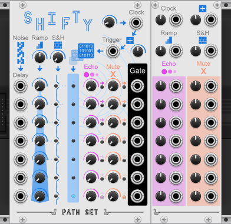

# Examples for PathSet Modules

The PathSet is family an eclectic and bespoke of plugins for [VCV Rack](https://vcvrack.com/). This page lists examples for all Modules. The [full manual](Manual.md) has more details on how each plugin works. The modules can be [download from VCV Library](https://library.vcvrack.com/?brand=Path%20Set).

## Orchestrator 

Plugin: [PathSet - Infinity](https://library.vcvrack.com/PathSet-Infinity)
Manual: [Orchestrator](Manual.md#orchestrator) 

**Examples:**
Comming Soon

## Quantum Compass 

Plugin: [PathSet - Infinity](https://library.vcvrack.com/PathSet-Infinity)
Manual: [QuantumCompass](Manual.md#quantum-compass) 

**Examples:**
Comming Soon

## Warp Drive

Plugin: [PathSet - Infinity](https://library.vcvrack.com/PathSet-Infinity)
Manual: [WarpDrive](Manual.md#warp-drive) 

**Examples:**
Comming Soon

## Astro Vibe

Plugin: [PathSet (Free)](https://library.vcvrack.com/PathSet-Infinity)
Manual: [AstroVibe](Manual.md#astro-vibe) 

**Examples:**
* [AstroVibe_Example1](examples/AstroVibe/AstroVibe_Example1.vcv) - Shows all 4 possible combinations of Engine and Waveform when used in audio output. Also demonstrates the variety the planetary signature provides the oscillator. 
* [AstroVibe_Example2](examples/AstroVibe/AstroVibe_Example2.vcv) - Polyphonic example also using one of the obiters as an LFO and the internal routing.
* [AstroVibe_Example3](examples/AstroVibe/AstroVibe_Example3.vcv) - More complete atmospheric patch showing off two AstroVibes.

Note examples use [other plugins](#other-plugins).

## Ice Tray

Plugin: [PathSet (Free)](https://library.vcvrack.com/PathSet)
Manual: [IceTray](Manual.md#ice-tray)

**Examples:**
* [IceTray_Example1](examples/IceTray/IceTray_Example1.vcv) - Mini Tutorial of IceTray with a simple voice and lots of notes.
* [IceTray_Example2](examples/IceTray/IceTray_Example2.vcv) - Example of a single voice through IceTray with modulation.
* [IceTray_Example3](examples/IceTray/IceTray_Example3.vcv) - IceTray with another delay and reverb to create more variety in the sound.

Note examples use [other plugins](#other-plugins).

## Shifty

Plugin: [PathSet (Free)](https://library.vcvrack.com/PathSet)
Manual: [Shifty](Manual.md#shifty)

**Examples:**
* [Shifty_Example0](examples/Shifty/Shifty_Example0.vcv) - Using Shifty as a Clock
* [Shifty_Example1](examples/Shifty/Shifty_Example1.vcv) - Uses the first two gates of Shift to drive a drum beat out of two Palettesand the remaining gates are used as CVs on the VCOs and effects.
* [Shifty_Example2](examples/Shifty/Shifty_Example2.vcv) - 5 Shiftys working to drive 3 different voices. Each voice showing off different ways to use Shifty.
* [Shifty_Example3](examples/Shifty/Shifty_Example3.vcv) - Shifty outputs are merged to create a polyphonic gate. Along with a polyphonic VCO this creates melodic variety with a high degree of configurability.
* [Shifty_Example4](examples/Shifty/Shifty_Example4.vcv) - More examples of melodic patterns created by Shifty and chaining shifty together.
* [Shifty_Example5](examples/Shifty/Shifty_Example5.vcv) - Using LFOs to mores slowly change Shifty's pattern over time. 

## Other Plugins
The [examples patches](https://github.com/patheros/PathSetModules/tree/main/examples) in this repository use these other plugins. They are all free but you will need to subscribe to them in order to load the examples.

1. [Alright Devices](https://library.vcvrack.com/AlrightDevices)
1. [Arron Static](https://library.vcvrack.com/AaronStatic)
1. [Befaco](https://library.vcvrack.com/Befaco)
1. [Bogaudio](https://library.vcvrack.com/Bogaudio)
1. [Count Modula](https://library.vcvrack.com/CountModula)
1. [Impromptu](https://library.vcvrack.com/ImpromptuModular)
1. [JW-Modules](https://library.vcvrack.com/JW-Modules)
1. [Mind Meld](https://library.vcvrack.com/MindMeldModular)
1. [Palette](https://library.vcvrack.com/Atelier/AtelierPalette)
1. [RCM](https://library.vcvrack.com/rcm)
1. [Vult Free](https://library.vcvrack.com/VultModulesFree)
