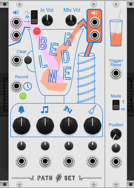
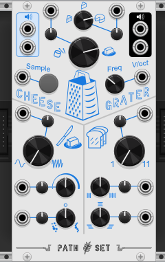

# PathSet Modules for VCV Rack

The Path Set is family an eclectic and bespoke of plugins for [VCV Rack](https://vcvrack.com/).

## Path Set: Grains 

### Blender
 
[Blender Manual](modules/Blender.md) 
A "Distorion Looper". Play with 4 main knobs to snapshot dynamic effects.

### Cheese Grater
 
[CheeseGrater Manual](modules/CheeseGrater.md) 
A granular sample and loop. Craft the exact right slice of sound for your music.

### Sifter
 
[Sifter Manual](modules/Sifter.md) 
A granular mixer. Sample 4 sound sources and recombine them endlessly through modulation.

### Spork
 
[Spork Manual](modules/Spork.md) 
A granular FX module. Modulate 6 different granular effects.

## Path Set: Infinity
The Infinity set explores modules with near-infinite internal configurations. These internal signatures can be randomizes but are unlikely to be found again once changed.

### Orchestrator
 
[Orchestrator Manual](modules/Orchestrator.md) 
A conniving octopus that bends everything to it's master plan. Orchestrator generates 24 randomish modulation and gate outputs that repeat to create an up to 10 minute long song.
  

### Quantum Compass
 
[QuantumCompass Manual](modules/QuantumCompass.md) 
Sequencer or Quantizer? Its both and neither at the same time. Create a melodic sequence by selecting notes and letting the Quantum Compass guide you on the rest of the path.
  

### Warp Drive
 
[WarpDrive Manual](modules/WarpDrive.md) 
Ten total oscillators grouped into deep dual-drive systems. Explore a vast range of sounds with built in clocks, lfos, and envelops.
  

## Path Set: Free

### Astro Vibe
 
[AstroVibe Manual](https://github.com/patheros/PathSetModules#astro-vibe) 
Three stereo oscillators or LFOs with random waveforms. Explore a universe of unique waveforms.
  

### Glass Pane
 
[GlassPane Manual](modules/GlassPane.md) 
Patchable, branchable, network sequencer. Create a cascading intricate self modulating sequence.
  

### Ice Tray
 
[IceTray Manual](https://github.com/patheros/PathSetModules#ice-tray) 
Speed shifter and tape delay with selective memory. Perform into this and it will never forget your mistakes.
  

### Shifty
 
[Shifty Manual](https://github.com/patheros/PathSetModules#shifty) 
Gate shift register with controllable delays. Create generative gate sequences from a simple clock.
  

## License
PathSet brand and artwork Copyright (c) 2022 Andrew Hanson, All rights reserved.

The contents of the manuals here are licensed under [CC BY-NC 4.0](https://creativecommons.org/licenses/by-nc/4.0/).

The plugins they reference to are covered under various licenses. See their individual liceneses in the [VCV Rack Library](https://library.vcvrack.com/?brand=Path%20Set)
