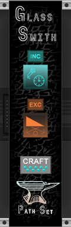
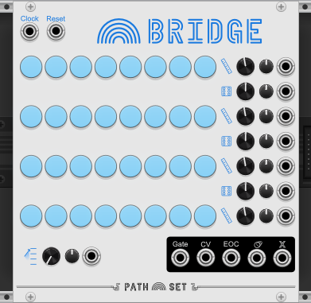

# PathSet Modules for VCV Rack

The Path Set is family an eclectic and bespoke of plugins for [VCV Rack](https://vcvrack.com/).

## Path Set: Glass Shard

### Glass Shard (Free)
 
[GlasssShard Manual](modules/GlassShard.md) 
Node based sequencer like with random imperfections each week to spark a creative melody in you.

### Glass Smith
 
[GlsssSmith Manual](modules/GlassSmith.md) 
Utility module for creating new configurations of GlassShard.

## Path Set: Rainbows 

Rainbows expands the horizons of generative sequencers with four powerfully configurable sequencers that each can have two expanders added.

### Video Manual

### Bridge
 
[Bridge Manual](modules/Bridge.md) 
Start with four linear sequences and build bridges to connect and jump around.

### Crossing
 
[Crossing Manual](modules/Crossing.md) 
Create paths and circuits and loops in this field of notes.

### Grid
 
[Grid Manual](modules/Grid.md) 
Generate a panoply of sequences using a small grid of nine notes.

### Ring
 
[Ring Manual](modules/Ring.md) 
Concentric rings of notes create an ever shifting sequence.

## Path Set: Grains 

Grains provides granular synthesis modules with unique flavors.

### Blender
 
[Blender Manual](modules/Blender.md) 
A "Distortion Looper". Play with 4 main knobs to snapshot dynamic effects.

### Cheese Grater
 
[CheeseGrater Manual](modules/CheeseGrater.md) 
A granular sample and loop. Craft the exact right slice of sound for your music.

### Sifter
 
[Sifter Manual](modules/Sifter.md) 
A granular mixer. Sample 4 sound sources and recombine them endlessly through modulation.

### Spork
 
[Spork Manual](modules/Spork.md) 
A granular FX module. Modulate 6 different granular effects.

## Path Set: Infinity
Infinity explores modules with near-infinite internal configurations. These internal signatures can be randomizes but are unlikely to be found again once changed.

### Orchestrator
 
[Orchestrator Manual](modules/Orchestrator.md) 
A conniving octopus that bends everything to it's master plan. Orchestrator generates 24 randomish modulation and gate outputs that repeat to create an up to 10 minute long song.
  

### Quantum Compass
 
[QuantumCompass Manual](modules/QuantumCompass.md) 
Sequencer or Quantizer? Its both and neither at the same time. Create a melodic sequence by selecting notes and letting the Quantum Compass guide you on the rest of the path.
  

### Shuttle
 
[Shuttle Manual](modules/Shuttle.md) 
An additive sine-wave oscillator with up to 15 harmonics. Travel between the infinite permutations of different harmonics or use a polyphonic cable to modify your destination.

### Warp Drive
 
[WarpDrive Manual](modules/WarpDrive.md) 
Ten total oscillators grouped into deep dual-drive systems. Explore a vast range of sounds with built in clocks, lfos, and envelops.
  

## Path Set: Free

### Astro Vibe
 
[AstroVibe Manual](modules/AstroVibe.md) 
Three stereo oscillators or LFOs with random waveforms. Explore a universe of unique waveforms.
  

### Glass Pane
 
[GlassPane Manual](modules/GlassPane.md) 
Patchable, branchable, network sequencer. Create a cascading intricate self modulating sequence.
  

### Ice Tray
 
[IceTray Manual](modules/IceTray.md) 
Speed shifter and tape delay with selective memory. Perform into this and it will never forget your mistakes.
  

### Nudge
 
[Nudge Manual](modules/Nudge.md) 
Modulation generator that lets you randomly nudge the modulations whenever you want.
  

### One Shot 
 
[OneShot Manual](modules/OneShot.md) 
Chain-able sequencer. Add shots of espresso to any bland sequencer.

### Shifty
 
[Shifty Manual](modules/Shifty.md) 
Gate shift register with controllable delays. Create generative gate sequences from a simple clock.
  

## License
PathSet brand and artwork Copyright (c) 2022 Andrew Hanson, All rights reserved.

The contents of the manuals here are licensed under [CC BY-NC 4.0](https://creativecommons.org/licenses/by-nc/4.0/).

The plugins they reference to are covered under various licenses. See their individual licenses in the [VCV Rack Library](https://library.vcvrack.com/?brand=Path%20Set)
