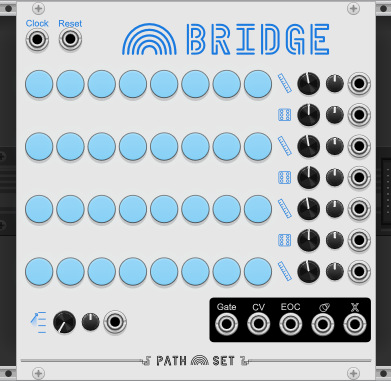
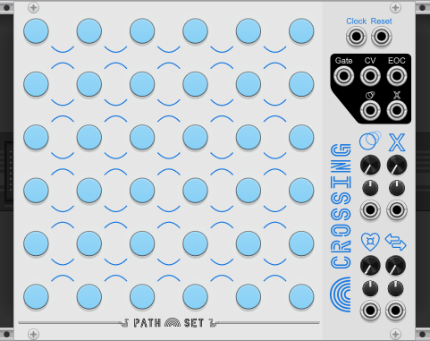
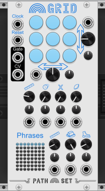

# Upcomming PathSet Modules for VCV Rack

Here are the modules currently in development

## Path Set: Rainbows 

### Bridge
 
[Bridge Manual](modules/Bridge.md) 
Start with four linear sequences and build bridges to connect and jump around.

### Crossing
 
[Crossing Manual](modules/Crossing.md) 
Create paths and circuits and loops in this field of notes.

### Grid
 
[Grid Manual](modules/Grid.md) 
Generate a panoply of sequences using a small grid of nine notes.

### Ring
 
[Ring Manual](modules/Ring.md) 
Concentric rings of notes create an ever shifting sequence.

## License
PathSet brand and artwork Copyright (c) 2022 Andrew Hanson, All rights reserved.

The contents of the manuals here are licensed under [CC BY-NC 4.0](https://creativecommons.org/licenses/by-nc/4.0/).

The plugins they reference to are covered under various licenses. See their individual licenses in the [VCV Rack Library](https://library.vcvrack.com/?brand=Path%20Set)
