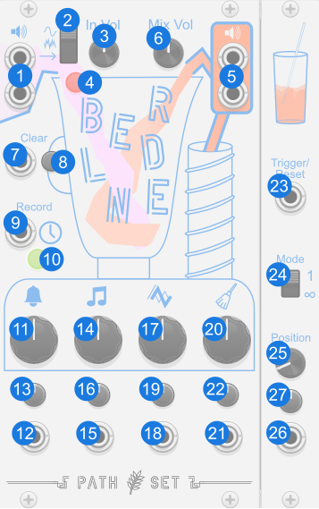

# Blender

Blender is a “Knob Instrument”. It was created to allow you to capture all the bizare transient effects you get when you turn knobs on your favorite delay or reverb modules. Blender simple needs an input sound and then feeds a sample of that back into itself, recording a new sample each time you turn one of the four main knobs.

## Quick Start

[Download Quick Start](../examples/Blender/Blender_QuickStart.vcvs?raw=true)

Disable the bypass on Blender in this module and it will record a one second sample of the input sine wave. Then turn one of the four big knobs on the front. Play around with turning the knobs slowly, or even holding the mouse button down on one of the knobs. Every time you press down on one of those knobs you start recording a new sample, and when you release that sample automatically starts playing back. You can always press the reset button to get the one second of sign wave back again.

## Panel

1. **Audio Input** - Input audio source.
2. **Audio Output** - Output audio source. 
3. **Input Volume** - Controls how loud the input audio is in the mix. This knob starts all the way down but is ignored for the first sample after the module is reset. 
4. **Mix Volume** - Controls how loud the output audio is mixed back into the next sample. This knob reset to 1 after each sample is recorded because the reduced audio is baked into the sample at that point.
5. **Clock Input** - Optional input that reset the playback positions each time it goes high. 
6. **Reset Button** - Clears the internal sample and triggers a 1 second recording if a cable is patched to `Audio Input`
7. **Reset Trigger** - Triggers reset button when the signal is high.
8. **Blend Button** - Press and hold to record a new sample. When released the recorded sample automatically starts playing.
9. **Blend Trigger** - Triggers the blend button when the signal is high.
10. **Auto Blend** - When on, turning any of the 4 main knobs will start a recording. The recording will stop when the knob is released.
11. **Ring Knob** - Applies a resonating delay to the sample. Turning the knob clockwise has a linear effect. Turning the knob counter clock wise has an exponential effect.
12. **Ring CV** - Modulates Ring Knob.
13. **Ring Attenuverter** - Modifies CV for Ring Knob.
14. **Pitch Knob** - Shifts the pitch of the sample up or down.
15. **Pitch CV** - Modulates Pitch Knob.
16. **Pitch Attenuverter** - Modifies CV for Pitch Knob.
17. **Scratch Knob** - Applies a turn-table style effect to the sample.
18. **Scratch CV** - Modulates Scratch Knob.
19. **Scratch Attenuverter** - Modifies CV for Scratch Knob.
20. **Filter Knob** - Filters the sample. Turning the knob clock wise applies a high pass filter. Turning the knobe counter-clockwise applies a low pass filter.
22. **Filter CV** - Modulates Filter Knob.
22. **Filter Attenuverter** - Modifies CV for Filter Knob.

### Bypass
When Blender is bypassed the `Audio Input` is routed to the `Audio Output`.
