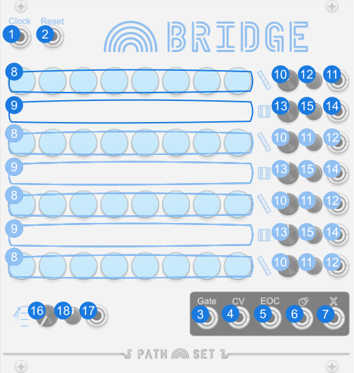
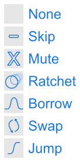

# Bridge

Bridge is a sequencer with four rows of notes and three "bridges" that connect the rows.

Like every sequencer in the Rainbows set, Bridge is designed to sequence notes. Each step in the sequence can be set to a specific note by clicking the corresponding note. Bridge also can also have three more sequencers running on the same module by adding the expander through the contextual menu.

## Panel

1. **Clock input** - Advances the sequencer to the next state depending on which ports are connected.
2. **Reset input** - Resets the sequencer to the first state and resets all nodes to their last manually selected mode.
3. **Gate output** - Gate signal to attach to a voice or envelope generator.
4. **CV output** - The CV value here matches the knob of the current state. 
5. **End of Cycle Gate output** - Gate signal that is high on the first step of the sequence after each time the cycle ends.
6. **Ratchet Gate output** - Gate signal that is high whenever the sequencer is ratcheting.
7. **Mute Gate output** - Gate signal that is high whenever the sequencer is muted.
8. **Notes** - Notes for each sequence. Right click for more options.
9. **Bridges** - Bridge settings. Note bridges effects apply to both adjacent sequences. Right click to directly set the effect.
10. **Length Knob** - Controls the length of the row. When above 8, the sequence will ping-pong, repeating each end node.
11. **Length CV** - Modulates the Length Knob.
12. **Length Attenuverter** - Modifies CV for Length Knob.
13. **Odds Knob** - Controls the chance of the bridge effects applying.
14. **Odds CV** - Modulates the Odds Knob.
15. **Odds Attenuverter** - Modifies the CV for the Odds Knob.
16. **Start Row Knob** - Controls which row the sequence starts at.
17. **Start Row CV** - Modulates the Start Row Knob.
18. **Start Row Attenuverter** - Modifies the CV for the Start Row Knob.

## Features

### Notes

Like every sequencer in the Rainbows set, the notes on Bridge can be set clicking the light. Left clicking will allow you to select from the currently selected scale. Right clicking will allow for more options. From the right click menu you can:

- **Randomize Notes** - Randomizes ALL notes on the module. Only selects from the current scale.
- **Set Scale & Randomize** - Change the scale and randomizes all notes on the module.
- **Set Scale** - Change the scales. Will NOT change any notes currently on the module.
- **Set Any Note** - Lets you set the note, even if its not in the current scale.

Rainbow set is limited to a 3 octave range, from A3 up to G#5

### Bridge Effects

The space between the sequences on Bridge have several different effects that can be configured. These settings affect the two adjacent notes. Each row of bridge effects has a chance to apply that can be controlled by the `Odds knobs` on the right of the panel.

The different bridge effects are:

1. **None** - No Effect
2. **Skip** - The note is skipped. The note still counts against the sequence length, effectively shortening the sequence. Also the sequence cannot skip more than eight notes in a row.
3. **Mute** - The note is silent. The normal `Gate` is low, the `CV output` holds its previous value, and the `Mute Gate` is high.
4. **Ratchet** - Causes several notes to be played in quick succession. The module selects notes from the same column. The number of notes played can be configured from Ratchet Speed option the contextual menu.
5. **Borrow** - Plays the note from the other sequence instead.
6. **Swap** - Swaps the notes from the two adjacent sequences.
7. **Jump** - Moves the playhead over to the other sequence.

### Expander - Four Playheads

Like every sequencer in the Rainbows set, Bridge has an expander. You can add the expander in the contextual menu. The expander creates four independent playheads. When the expander is attached you will see the selected note ring is now broken up into four quadrants, one for each of the four playheads.

The `Clock` and `Reset` inputs on the main module drive all four playheads, but you can also use independent clock and reset inputs on the expander to drive each playhead at a different rate.

On Bridge, the four playheads automatically start on different rows so that in its initial configuration, Bridge has four independent sequences. The `Start Row Knob` offsets all playheads.

### Contextual Menu

- **Randomize Notes** - Randomizes ALL notes on the module. Only selects from the current scale.
- **Set Scale & Randomize** - Change the scale and randomizes all notes on the module.
- **Set Scale** - Change the scales. Will NOT change any notes currently on the module.
- **Ratchet Speed** - Controls how fast the Ratchet mode plays. When set to `Whole Notes` the Ratchet speed is equal to the clock. `Half Notes` plays twice per clock etc.
- **Add Expander** - Adds a 9HP expander to the right of the module. 

### Bypass

When Bridge is bypassed the `Gate output` is connected to the `Clock input`.
