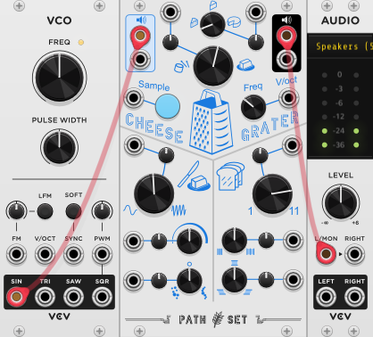
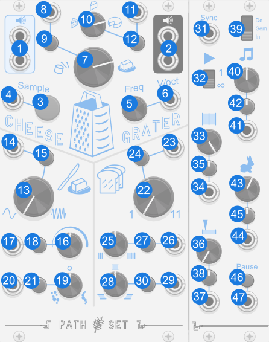

# Cheese Grater

Cheese Grater is a granular sample and loop. Feed an audio source into it, press and hold the sample button, then play around with the parameters to affect how that sample is granulated.

## Quick Start

[Download Quick Start](../examples/CheeseGrater/CheeseGrater_QuickStart.vcvs?raw=true)

This simple example puts a sine wave into the audio input on Cheese Grater. Press the green button to sample the sine wave. The longer you hold it the longer the sample. Once you have a sample, play around with the knobs to affect the granulation. Note that while the sample is playing back the audio input is ignored.

## Panel

1. **L/R Audio / Sample Input** - Audio input that is sampled while the sample button is pressed or the sample gate is high.
2. **L/R Audio Output** - Audio output of the module. No audio is sent out while sampling.
3. **Sample Button** - Press and hold to sample the input audio. 
4. **Sample Gate Input** - Functions like the sample button when high.
5. **Frequency Knob** - Controls the frequency the output sample is played at. When set to C4 the output is played at the same frequency as the input sample.
6. **V/Oct Input** - Controls the frequency the output sample is played at. Each volt above or below 0 shifts the output sample one octave.
7. **Consistency Knob** - Controls how many grains are playing at once. When turned clockwise more than one grain plays at once. When turned counter-clockwise there is a gap between when grains play.
8. **Consistency CV** - Modulates Consistency Knob.
9. **Consistency Attenuverter** - Modifies CV for Consistency Knob.
10. **Grain Size Knob** - Controls how long each grain is. When grain size is below 0 weird stuff happens.
11. **Grain Size CV** - Modulates Grain Size Knob.
12. **Grain Size Attenuverter** - Modifies CV for Grain Size Knob.
13. **Spread Knob** - Applies a sine wave to the start time of each grain. Increasing this knob increases the frequency of the sine wave. 
14. **Spread CV** - Modulates Spread Knob.
15. **Spread Attenuverter** - Modifies CV for Spread Knob.
16. **Spread Strength** - Controls the amplitude of the sine wave applied to the grain start time by the Spread Knob.
17. **Spread Strength CV** - Modulates Spread Strength Knob.
18. **Spread Strength Attenuverter** - Modifies CV for Spread Strength Knob.
19. **Spread Randomness** - Adds a random offset to the start time of each grain. When turned clockwise the randomness is softer. When turn to the left the randomness is purely random.
20. **Spread Randomness CV** - Modulates Spread Randomness Knob.
21. **Spread Randomness Attenuverter** - Modifies CV for Spread Randomness Knob.
22. **Slices of Toast** - Turn this up to layer up multiple grains at the same time. Use this to add more depth to a sound. It is especially useful when `grain size` or `consistency` is below 0. 
23. **Slices of Toast CV** - Modulates Slices of Toast Knob.
24. **Slices of Toast Attenuverter** - Modifies CV for Slices of Toast Knob.
25. **Slice Seperation** - Controls the length of time between each `slice of toast` starting.
26. **Slice Seperation CV** - Modulates Slice Seperation Knob.
27. **Slice Seperation Attenuverter** - Modifies CV for Slice Seperation Knob.
28. **Slice Depth** - Controls where in the sample each slice of toast comes from.
29. **Slice Depth CV** - Modulates Slice Depth Knob.
30. **Slice Depth Attenuverter** - Modifies CV for Slice Depth Knob.

### Bypass
When Cheese Grater is bypassed the `Audio Input` is routed to the `Audio Output`.
