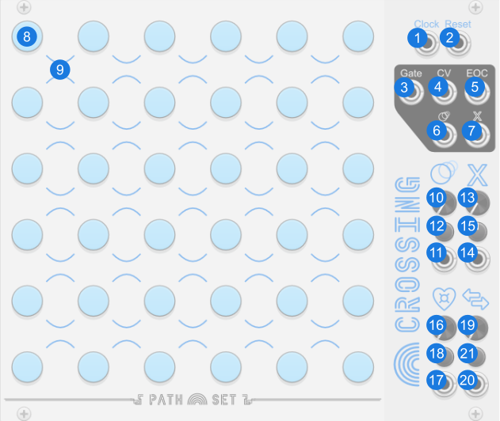
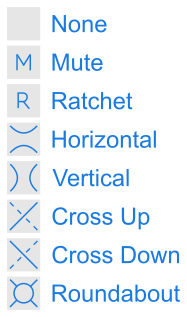

# Crossing

Crossing is a sequencer with field of notes and intersections. Each intersection can be configured to allow notes through in different ways.

Like every sequencer in the Rainbows set, Crossing is designed to sequence notes. Each step in the sequence can be set to a specific note by clicking the corresponding note. Crossing can also have two different expanders. One adds more play-heads the other one adds configurable randomizing triggers.

## Panel

1. **Clock input** - Advances the sequencer to the next state depending on which ports are connected.
2. **Reset input** - Resets the sequencer to the first state and resets all nodes to their last manually selected mode.
3. **Gate output** - Gate signal to attach to a voice or envelope generator.
4. **CV output** - The CV value here matches the knob of the current state. 
5. **End of Cycle Gate output** - Gate signal that is high whenever the playhead has to turn around.
6. **Ratchet Gate output** - Gate signal that is high whenever the sequencer is ratcheting.
7. **Mute Gate output** - Gate signal that is high whenever the sequencer is muted.
8. **Notes** - Field of Notes. Right click for more options.
9. **Crossings** - Crossing. These crossings control how the playhead moves through the module. Right click to directly set the effect.
10. **Ratchet Knob** - Controls the chance of a Ratchet Crossing to have its effect.
11. **Ratchet CV** - Modulates the Ratchet Knob.
12. **Ratchet Attenuverter** - Modifies CV for Ratchet Knob.
13. **Mute Knob** - Controls the chance of the Crossing effects applying.
14. **Mute CV** - Modulates the Mute Knob.
15. **Mute Attenuverter** - Modifies the CV for the Mute Knob.
16. **Roundabout Love Knob** - Controls how likely the playhead is to stay in a roundabout.
17. **Roundabout Love CV** - Modulates the Roundabout Love Knob.
18. **Roundabout Love Attenuverter** - Modifies the CV for the Roundabout Love Knob.
19. **Opposite Knob** - Gives the playhead a chance for the playhead to do the opposite thing at a crossing.
20. **Opposite CV** - Modulates the Opposite Knob.
21. **Opposite Attenuverter** - Modifies the CV for the Opposite Knob.

## Features

### Notes

Like every sequencer in the Rainbows set, the notes on Crossing can be set clicking the light. Left clicking will cycle through the notes from the currently selected scale and range. Right clicking will allow for more options. From the right click menu you can:

- **Set Note** - Lets you set the note from the current scale and range.
- **Set Any Note** - Lets you set the note, even if its not in the current scale.
- **Randomize Notes** - Options for randomizing notes.
  - **Randomize All Notes** - Randomizes ALL notes on the module. Only selects from the current scale.
  - **+1 Octave To Some Notes** - Shifts some notes up an octave.
  - **-1 Octave To Some Notes** - Shifts some notes down an octave.
- **Set Scale** -  Change the scale and randomizes all notes on the module.
- **Root Note** -  Change the root note and shifts all entered notes up by the difference from the current root note to the new root note.

### Crossing Effects

At the corner of every four notes is a crossing. Each crossing can have one of several different effects.

The different Crossing effects are:

1. **None** - No effect
2. **Mute** - Chance for the next note to be silent. The chance is determined by the `Mute knob`. When the note is silent, the normal `Gate` is low, the `CV output` holds its previous value, and the `Mute Gate` is high.
3. **Ratchet** - Chance for the playhead to play quickly for the next few notes. The chance is determined by the `Ratchet knob`. When active the current playhead moves forward following the normal rules for each note played. The number of notes played can be configured from Ratchet Speed option the contextual menu.
4. **Horizontal** - Playhead moves left to right or right to left.
5. **Vertical** - Playhead moves top to bottom or bottom to top.
6. **Cross Up** - Playhead can cross to the opposite side of the intersection. The dashed line has restricted travel. The playhead can only cross the dashed line on every other attempt.
7. **Cross Down** - Same as Cross Up, but the dashed line goes the other way.
8. **Roundabout** - The playhead travels around the Roundabout in a clockwise direction.

### Play Head Expander

Like every sequencer in the Rainbows set, Crossing has a play head expander. You can add the expander in the contextual menu. The expander creates four independent playheads. When the expander is attached you will see the selected note ring is now broken up into four quadrants, one for each of the four playheads.

The `Clock` and `Reset` inputs on the main module drive all four playheads, but you can also use independent clock and reset inputs on the expander to drive each playhead at a different rate.

On Crossing, the four playheads start at the same location, but if they reach a position with multiple possible paths, they may diverge.

### Randomizer Expander

Like every sequencer in the Rainbows set, Crossing has randomizer expander. You can add the expander in the contextual menu. The expander gives you four button & trigger pairs that can be used to randomize notes on the module. You can also randomize each crossing on the module.

The randomized notes and crossings can be configured. Hold down a button for one second to enter configuration mode. In configuration mode clicking a note on the panel toggles it on and off. Hold down the button on the expander again to exit configuration mode.

### Contextual Menu

- **Randomize Notes** - Options for randomizing notes.
  - **Randomize All Notes** - Randomizes ALL notes on the module. Only selects from the current scale.
  - **+1 Octave To Some Notes** - Shifts some notes up an octave.
  - **-1 Octave To Some Notes** - Shifts some notes down an octave.
- **Crossings**
  - **Initialize** - Resets all crossings to their default values.
  - **Randomize** - Randomizes all crossings.
- **Set Scale** -  Change the scale and randomizes all notes on the module.
- **Root Note** -  Change the root note and shifts all entered notes up by the difference from the current root note to the new root note.
- **Range** - Sets the range of the current notes. Octave range is centered around the perfect 5th note above the root note.
- **Ratchet Speed** - Controls how fast the Ratchet mode plays. When set to `Whole Notes` the Ratchet speed is equal to the clock. `Half Notes` plays twice per clock etc.
- **Active Cursor Color** - Controls what color ring is used to show which notes are active.
- **Add Expander** - Add various expanders.
  - **Play Head Expander** - Gives the module 3 more playheads.
  - **Randomizer Expander** - Gives buttons and triggers for randomizing notes on the module.

### Bypass

When Crossing is bypassed the `Gate output` is connected to the `Clock input`.
