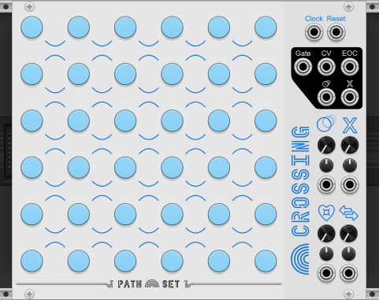

# Crossing

Crossing is a sequencer with field of notes and intersections. Each intersection can be configured to allow notes through in different ways.

Like every sequencer in the Rainbows set, Crossing is designed to sequence notes. Each step in the sequence can be set to a specific note by clicking the corresponding note. Crossing also can also have three more sequencers running on the same module by adding the expander through the contextual menu.

## Panel

1. **Clock input** - Advances the sequencer to the next state depending on which ports are connected.
2. **Reset input** - Resets the sequencer to the first state and resets all nodes to their last manually selected mode.
3. **Gate output** - Gate signal to attach to a voice or envelope generator.
4. **CV output** - The CV value here matches the knob of the current state. 
5. **End of Cycle Gate output** - Gate signal that is high whenever the play-head has to turn around.
6. **Ratchet Gate output** - Gate signal that is high whenever the sequencer is ratcheting.
7. **Mute Gate output** - Gate signal that is high whenever the sequencer is muted.
8. **Notes** - Field of Notes. Right click for more options.
9. **Crossings** - Crossing. These crossings control how the play-head moves through the module. Right click to directly set the effect.
10. **Ratchet Knob** - Controls the chance of a Ratchet Crossing to have its effect.
12. **Ratchet Attenuverter** - Modifies CV for Ratchet Knob.
13. **Mute Knob** - Controls the chance of the Crossing effects applying.
14. **Mute CV** - Modulates the Mute Knob.
15. **Mute Attenuverter** - Modifiers the CV for the Mute Knob.
16. **Roundabout Love Knob** - Controls how likely the play-head is to stay in a roundabout.
17. **Roundabout Love CV** - Modulates the Roundabout Love Knob.
18. **Roundabout Love Attenuverter** - Modifies the CV for the Roundabout Love Knob.
19. **Opposite Knob** - Gives the play-head a chance for the play-head to do the opposite thing at a crossing.
20. **Opposite CV** - Modulates the Opposite Knob.
21. **Opposite Attenuverter** - Modifies the CV for the Opposite Knob.

## Features

### Notes

Like every sequencer in the Rainbows set, the notes on Crossing can be set clicking the light. Left clicking will allow you to select from the currently selected scale. Right clicking will allow for more options. From the right click menu you can:

- **Randomize Notes** - Randomizes ALL notes on the module. Only selects from the current scale.
- **Set Scale & Randomize** - Change the scale and randomizes all notes on the module.
- **Set Scale** - Change the scales. Will NOT change any notes currently on the module.
- **Set Any Note** - Lets you set the note, even if its not in the current scale.

Rainbow set is limited to a 3 octave range, from A3 up to G#5

### Crossing Effects

At the corner of every four notes is a crossing. Each crossing can have one of several different effects.

The different Crossing effects are:

1. **None** - No Effect
2. **Mute** - Chance for the next note to be silent. The chance is determined by the `Mute knob`. When the note is silent, the normal `Gate` is low, the `CV output` holds its previous value, and the `Mute Gate` is high.
3. **Ratchet** - Chance for the play-head to play quickly for the next few notes. The chance is determined by the `Ratchet knob`. When active the current play-head moves forward following the normal rules for each note played. The number of notes played can be configured from Ratchet Speed option the contextual menu.
4. **Horizontal** - Play-head moves left to right or right to left.
5. **Vertical** - Play-head moves top to bottom or bottom to top.
6. **Cross Up** - Play-head can cross to the opposite side of the intersection. The dashed-line has restricted travel. The play-head can only cross the dashed-line on every-other attempt.
7. **Cross Down** - Same as cross up, but the dashed-line goes the other way.
8. **Roundabout** - The play-head travels around the roundabout in a clock-wise direction.

### Expander - Four Play-Heads

Like every sequencer in the Rainbows set, Crossing has an expander. You can add the expander in the contextual menu. The expander creates four independent play-heads. When the expander is attached you will see the selected note ring is now broken up into for quadrants, one for each of the four play-heads.

The `Clock` and `Reset` inputs on the main module drive all four-heads, but you can also use independently clock and reset inputs on the expander to drive each play-head at a different rates.

On Crossing, the four-play heads start at the same location, but if they reach a position with multiple possible paths, they may diverge.

### Contextual Menu

- **Randomize Notes** - Randomizes ALL notes on the module. Only selects from the current scale.
- **Set Scale & Randomize** - Change the scale and randomizes all notes on the module.
- **Set Scale** - Change the scales. Will NOT change any notes currently on the module.
- **Ratchet Speed** - Controls how fast the Ratchet mode plays. When set to `Whole Notes` the Ratchet speed is equal to the clock. `Half Notes` plays twice per clock etc.
- **Add Expander** - Adds a 9HP expander to the right of the module. 

### Bypass

When Crossing is bypassed the `Gate output` is connected to the `Clock input`.