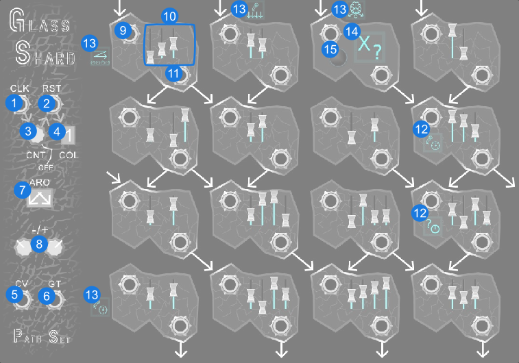
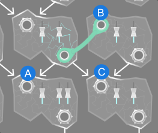

# Glass Shard

Shattered slivers of [Glass Pane](https://library.vcvrack.com/PathSet/GlassPane), Glass Shard is not just one sequencer, but thousands of sequencers each with its own imperfect scars and unique quirks.

## Quick Start

[Quick Start](../examples/GlassShard/GlassShard_QuickStart.vcvs?raw=true) (Copy and paste into Rack)

The imperfections in each configuration GlassShard are meant to be a creative muse. Each week you get a new configuration that will allow you to explore a new set of generative sequences. Unlike its pristine predecessor, [GlassPane](https://library.vcvrack.com/PathSet/GlassPane), GlassShard doesn't need much to start creating a sequence. Simply randomize the CVs, hook up a clock source and a voice, and you are in business.

## Panel

1. **Clock** - This advances the sequencer to the next state depending on which ports are connected.
2. **Reset** - Resets the sequencer. The COL controls how it is reset.
3. **Reset Count** - Triggers a reset every X node transition. Turn completely clockwise to disable.
4. **Reset Column** - Sets which column the sequencer resets to. Current keeps it in the same column. Next/Previous moves one to the right/left, wrapping around. Random selects a column at random each time.
5. **CV Output** - The CV value here matches the slider of the current state. This will have polphony when Echo, Waterfall, or Duet modifiers are present in the configuration.
6. **Gate Output** - Gate signal to attach to a voice or envelope generator. This will have polphony when Echo, Waterfall, or Duet modifiers are present in the configuration.
7. **Arrow Intensity** - Controls which arrows are active. Note that each configuration of Glass Shard has different possible arrows.
8. **Lowest/Highest CV** - Controls the CV range of the sliders and CV output.

**Per Node:**

9. **Node Input** - Trigger input. Connect to the output of another node or an external gate.
10. **CV Sliders** - Controls the CV value for this node. Each node can have 1 to 4 possible sliders. The number and placement of sliders changes with different configurations of Glass Shard. Each node take up four pulses, if fewer than four sliders are shown, the pulses will divide accordingly. Spacing between sliders denotes how this division is done.
11. **Node Output** - Output for this node. Connect to the input of one or more other nodes or use as a gate.

**Modifiers:**

12. **Per Node** - Small modifiers on nodes apply only to the node it is on.
13. **Row / Column** - Modifiers in the margins apply to a row or column.
14. **Global** - Large modifiers on a node apply to the whole module but are toggled on and off each time the node is visited.
15. **Global Toggle** - Global modifiers can also be toggled by pressing this button.

Turn Tooltips on and hover over any modifier to learn what it does.

## Features

### Configurations

Each instance of Glass Shard can have a different configuration of arrows, symbols, and sliders.

A new configuration is available each week and is the same for all users. Don't worry about your patch changing on you; Old instances of Glass Shard will remember their old configuration. If you would like the new configuration simply create a new instance of Glass Shard or update an existing instance by using the `This Week's Config` option in the context menu. The premium module [Glass Smith](https://library.vcvrack.com/PathSet-GlassShard-Premium/GlassSmith) also lets you generate a new configuration each day.

Configurations are collectible. Every time you use a configuration it's added to your configuration library for use later. Use the options in the context menu to change between configurations.

### Arrows and Connections

Glass Shard has its own internal connections, shown as arrows on the panel. These arrows are different with each configuration and control which node plays next. You can turn these arrows on and off using the ARO (Arrow Intensity) control.

In addition to the arrows on the panel, you can also patch your own connections. Connect the output of any node to the input of any other, to add another connection. You can even patch the same output to multiple inputs to create even more branching. You can also use cable stacking to multiple outputs to the same input.

These arrows and connections control what order Glass Shard plays its nodes in. In the example picture below, the node has three different possible things it can do when it's done. It can A) trigger the left arrow, B) trigger the output cable, or C) trigger the right arrow. Normally nodes will remember the last option selected and do the next one in order. Modifiers can change this behavior.

If the output of one node is connected to the input on multiple nodes, Glass Shard will cycle through each of the connected nodes each time the output cable is connected. With both arrows active and two nodes connected it would give a sequence of: Left, Node 1, Right, Left, Node 2, Right, repeat.

### Modifiers

The teal icons on the panel of Glass Shard are the modifiers. These modifiers are different with each configuration and add a wide array of effects. Modifiers can apply to a node, a row, a column, or globally. To learn what a modifier does, turn tooltips on and hover over the modifier.

You are encouraged to explore the modifiers as you find them, but if you would like a full list of all modifiers see the manual for the premium [Glass Smith](https://github.com/patheros/PathSetManuals/blob/main/modules/GlassSmith.md) module.

### Resets

Glass Shard's branching nature leads to pretty chaotic sequences. To help rein this in, Glass Shard has an internal clock counter that triggers a reset. But what if you want chaos? Have no fear, just turn the knob all the way clockwise to disable the reset.

What a reset on GlasShard does can also be modified. The COL control sets which column the module resets to. It also has two special options. Current resets to the top of the currently active column. Next resets one column to the right, wrapping around as needed. The reset behavior is the same if the reset is from a CV trigger or from the internal clock.

If a node does not have any arrows or patch cables, this will also trigger a reset.

### Config Collection

The Config Collection can be accessed from the right-click menu. It allows you to see all the configs you've used.

You can favorite configs from the Config Collection. Right-click to toggle It allows you to favorite configurations by right-clicking. You can filter to show only favorites.

You can also filter configs by pressing the Filter by Modifier button in the Config Collection

### Bypass

When Glass Shard is bypassed all outputs stay at 0V.

### Contextual Menu

**Quantizer** - Built in Quantizer.

**Randomize CVs** - Randomizes all CV sliders on all nodes.

**This Week's Config** - Sets the configuration of this module to be the current week's configuration. Note this is the initial configuration for a new module, so this won't have any effect on a new module. New configs are released on Sunday.

**Config Collection** - Opens up the configuration library, allowing you to browse all configurations you've ever used.

**Random Config from Collection** - Sets this module to a random configuration in your library.
