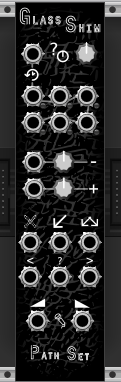
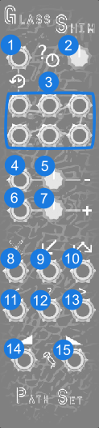

# Glass Shim

Glass Shim is a premium expander to the free sequencer [Glass Shard](https://library.vcvrack.com/PathSet-GlassShard/GlassShard). Glass Shim is an array of extra triggers and two new outputs.

## Panel

**CV Randomization and History:** 

1. **Randomize CV input** - Triggers new random CV values. Each note on Glass Shard has a chance to get a new CV value.
2. **Randomize CV Strength knob** - Controls the chance that Randomize CV input will change each note.
3. **Restore CV input** - Stores up the the last 6 CV values that have been replaced by Randomzie CV triggers. These triggers will restore those values.

**CV control over CV Range:**

4. **CV for Lowest CV Knob input** - Accepts a CV input that modifies the lowest CV range knob on Glass Shard.
5. **Attenuverter for Lowest CV Knob input** - Attenuates the CV value for input #4.
6. **CV for Hightest CV Knob input** - Accepts a CV input that modifies the highest CV range knob on Glass Shard.
7. **Attenuverter for Hightest CV Knob input** - Attenuates the CV value for input #6.

**Arrow Intensity Triggers:**

8. **No Arrows input** - Sets the arrow intensity on Glass Shard to No Arrows
9. **Left Arrow input** - Sets the arrow intensity on Glass Shard to Left Arrow
10. **All Arrows input** - Sets the arrow intensity on Glass Shard to All Arrows
11. **Shift Left Arrows input** - Changes the arrow intensity. All -> Left -> No -> All.
12. **Shift Left Arrows input** - Sets the arrow intensity to a random value.
13. **Shift Right Arrows input** - Changes the arrow intensity. No -> Left -> All -> No.

**Voice Count Outputs:**

14. **Voice Count output** - Outputs 1v for each voice actively playing.
15. **Inverted Voice Count output** - Outputs 10v if only one voice is playing, 5v if two voices, 3.33v if three voices, and 2.5v if four voices are playing.
