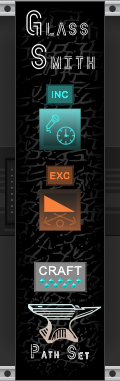

# Glass Smith

Glass Smith is a premium companion to the free sequencer [Glass Shard](https://library.vcvrack.com/PathSet-GlassShard/GlassShard). Glass Smith gives you the ability to craft one new configuration of Glass Shard every day. You will want to read the [Glass Shard manual](https://github.com/patheros/PathSetManuals/blob/main/modules/GlassShard.md) to better understand Glass Smith.

## Usage

Glass Smith lets you create a new Glass Share configuration with some limited control. You can force your new configuration to contain two specific modifiers. Or you can force your module to NOT have two specific modifiers modifiers. Or you can do one of each.

1. **Request Type** - Toggles if that modifier is forced to be included or excluded in the configuration you are about to create. 
2. **Request Modifier** - Controls which modifier is included or excluded.
3. **Craft Button** - Press and hold to craft a new configuration of Glass Shard.

Once you have the request type and modifiers picked, press and hold the craft button to use one of your daily charges to craft a configuration unique to you. An instance of Glass Shard will be created with the new configuration. The configuration will also be added to your Config Collection. Note that if you share a patch with other people, they will also get a copy of this configuration added to their Config Collection.

## Daily Limits

Glass Smith has a global number of charges. These are shown as teal gems on the craft button. Glass Smith will gain one charge every day and can hold up to nine charges. Each charge can be used to craft one new configuration of Glass Shard.

## Modifiers

Here is a full list of all the modifiers for Glass Shard.

| Image    | Effect   |
| -------- | -------- |
|  | After this node finishes playing the next branch is selected at random from left, right, or output. |