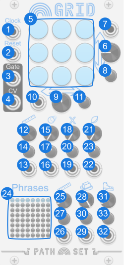

# Grid

Grid packs a whole lot of sequencer into a small grid of 9 notes.

Like every sequencer in the Rainbows set, Grid is designed to sequence notes. Each step in the sequence can be set to a specific note by clicking the corresponding note. Grid also can also have three more sequencers running on the same module by adding the expander through the contextual menu.

## Panel

1. **Clock input** - Advances the sequencer to the next state depending on which ports are connected.
2. **Reset input** - Resets the sequencer to the first state and resets all nodes to their last manually selected mode.
3. **Gate output** - Gate signal to attach to a voice or envelope generator.
4. **CV output** - The CV value here matches the knob of the current state. 
5. **Notes** - Field of Notes. Right click for more options.
6. **Vertical Bias Knob** - Biases the sequence to favor the top or bottom row.
7. **Vertical Bias CV** - Modulates Vertical Bias Knob Knob.
8. **Vertical Bias Attenuverter** - Modifies the CV for the Vertical Bias Knob.
9. **Horizontal Bias Knob** - Biases the sequence to favor the left or right columns.
10. **Horizontal Bias CV** - Modulates Horizontal Bias Knob Knob.
11. **Horizontal Bias Attenuverter** - Modifies the CV for the Horizontal Bias Knob.
12. **Sequence Length Knob** - Sets the length of the sequence. When turned all the way up the sequence is endless.
13. **Sequence Length CV** - Modulates Sequence Length Knob.
14. **Sequence Length Attenuverter** - Modifiers the CV for the Sequence Length Knob.
15. **Ratchet Knob** - Makes notes play quickly. The higher the knob the more often this happens. The number of notes played can be configured from Ratchet Speed option the contextual menu.
16. **Ratchet CV** - Modulates Ratchet Knob.
17. **Ratchet Attenuverter** - Modifies the CV for the Ratchet Knob.
18. **Mute Knob** - Makes notes silent. The higher the knob the more often this happens. When the note is silent, the normal `Gate` is low and the `CV output` holds its previous value.
19. **Mute CV** - Modulates Mute Knob.
20. **Mute Attenuverter** - Modifies the CV for the Mute Knob.
21. **Sequence Start Knob** - Offsets the sequence's start position, allowing for the selection of different sequences. Only applies when the sequence restarts.
22. **Sequence Start CV** - Modulates Sequence Start Knob.
23. **Sequence Start Attenuverter** - Modifies the CV for the Sequence Start Knob.
24. **Phrase Display** - Displays the generated Phrase. See Phrases section bellow for more details.
25. **Phrase Count Knob** - Controls how many Phrases are played before repeating.
26. **Phrase Count CV** - Modulates Phrase Count Knob.
27. **Phrase Count Attenuverter** - Modifies the CV for the Phrase Count Knob.
28. **Phrase Consistency Knob** - Controls how many of the Phrases are the the same and how many are variants.
29. **Phrase Consistency CV** - Modulates Phrase Consistency Knob.
30. **Phrase Consistency Attenuverter** - Modifies the CV for the Phrase Consistency Knob.
31. **Phrase Step Knob** - Changes the sequences used on the 'variants' phrases. 
32. **Phrase Step CV** - Modulates Phrase Step Knob.
33. **Phrase Step Attenuverter** - Modifies the CV for the Phrase Step Knob.

## Features

### Notes

Like every sequencer in the Rainbows set, the notes on Grid can be set clicking the light. Left clicking will allow you to select from the currently selected scale. Right clicking will allow for more options. From the right click menu you can:

- **Randomize Notes** - Randomizes ALL notes on the module. Only selects from the current scale.
- **Set Scale & Randomize** - Change the scale and randomizes all notes on the module.
- **Set Scale** - Change the scales. Will NOT change any notes currently on the module.
- **Set Any Note** - Lets you set the note, even if its not in the current scale.

Rainbow set is limited to a 3 octave range, from A3 up to G#5

### Phrases

Grid has a built phrase generator on the bottom of the panel. Each time the sequence length is hit, Grid advances to the next Phrase. By default all the Phrases generated are the same sequence. Lower the `Phrase Consistency` knob to add some variant Phrases. These variant Phrases will be shown as different colored lights. The flavor of each variant can be changed with the `Phrase Step` knob. The total number of Phrases can be set with the `Phrase Count` knob.

### Expander - Four Playheads

Like every sequencer in the Rainbows set, Grid has an expander. You can add the expander in the contextual menu. The expander creates four independent playheads. When the expander is attached you will see the selected note ring is now broken up into four quadrants, one for each of the four playheads.

The `Clock` and `Reset` inputs on the main module drive all four playheads, but you can also use independent clock and reset inputs on the expander to drive each playhead at a different rate.

On Grid, the four playheads start at the same point. The only way to get them to deviate is to clock them differently.

### Contextual Menu

- **Randomize Notes** - Randomizes ALL notes on the module. Only selects from the current scale.
- **Set Scale & Randomize** - Change the scale and randomizes all notes on the module.
- **Set Scale** - Change the scales. Will NOT change any notes currently on the module.
- **Ratchet Speed** - Controls how fast the Ratchet mode plays. When set to `Whole Notes` the Ratchet speed is equal to the clock. `Half Notes` plays twice per clock etc.
- **Add Expander** - Adds a 9HP expander to the right of the module. 

### Bypass

When Grid is bypassed the `Gate output` is connected to the `Clock input`.
