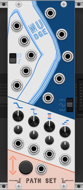
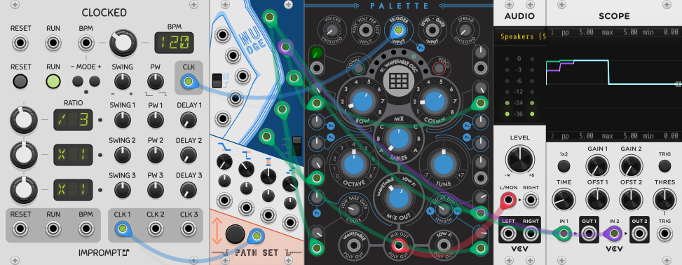
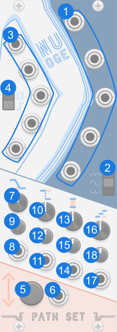
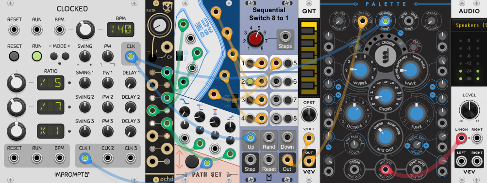
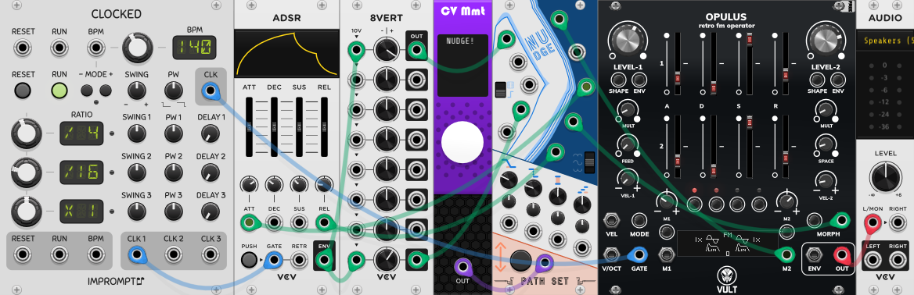

# Nudge

Nudge is a modulation source that generates five CV signals. The CV signals are generally constant, but you can Nudge them to new values whenever you want.

## Quick Start

[Download Quick Start](../examples/Nudge/Nudge_QuickStart.vcvs?raw=true)

In this example Nudge is being triggered every 3 beats to change the modulations going into [Palette](https://library.vcvrack.com/Atelier/AtelierPalette).

## Panel

1. **CV Outputs** - Main five CV Output ports
2. **Range Switch** - Controls if the CV values from Nudge are bipolar or unipolar.
3. **CV Inputs** - Five input CVs. The CV Input Mode Switch determines what these CV's do.
4. **CV Input Mode Switch** - Controls how the input CVs are used.
5. **Nudge Button** - Button used to cause the CV values to change.
6. **Nudge Trigger** - Trigger used to cause the CV values to change.
7. **Slew Knob** - Controls how long it takes for the CV values to change with each nudge.
8. **Slew CV** - Modulates the Slew Knob.
9. **Slew Attenuverter** - Modifies CV for the Slew Knob.
10. **Step Knob** - Controls how much the CV values can change with each nudge.
11. **Step CV** - Modulates the Step Knob.
12. **Step Attenuverter** - Modifies CV for the Step Knob.
13. **Range Knob** - Controls the min and max CV values.
14. **Range CV** - Modulates the Step Knob.
15. **Range Attenuverter** - Modifies CV for the Range Knob.
16. **Velocity Knob** - Controls how likely a CV is to nudge in the same direction as the last nudge.
17. **Velocity CV** - Modulates the Velocity Knob.
18. **Velocity Attenuverter** - Modifies the CV for the Velocity Knob.

## CV Input Modes

The CV Input Mode Switch controls what the CV Inputs do.

### Offset Mode

In this mode the CV Input's are added to the generated CV values. Note that the Range Knob and Switch are applied before the CV Input's offset is added.

### Chance to Nudge Mode

In this mode each CV has a chance to change when nudged. The CV Input's control this chance. 0V = 0% chance. 10V = 100% chance. When the CV Inputs are not connected the chances to nudge are 10%, 30%, 50%, 70%, and 90% for CV 1, 2, 3, 4 and 5 respectively.

### Bypass

When Nudge is bypassed the each of the CV inputs are routed to the corresponding CV outputs.

## Patch Examples

### Melody Generator

[Download Melody Generator Example](../examples/Nudge/Nudge_Example_MelodyGenerator.vcvs?raw=true)

In this example Nudge's CVs are being used as 5 step sequence. In this patch Nudge is in the "Chance to Nudge" mode, where each output has a chance to change when the nudge is triggered. Some of the chances for those changes are modulated by [Ochd](https://library.vcvrack.com/Instruo/ochd), letting the pattern chance more frequently some times and less frequently other times.

### Envelope + Opulus

[Download Envelope + Opulus Example](../examples/Nudge/Nudge_Example_Opulus.vcvs?raw=true)

In this example an [Opulus](https://library.vcvrack.com/VultModulesFree/Opulus) is being morphed by an ADSR envelope. But that envelop is being run through Nudge. Nudge is also modulating the attack and release on the ADSR. Try pressing the Nudge button to change the sound.

