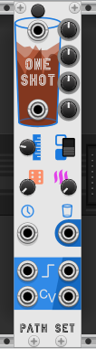
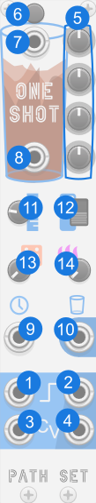

# OneShot

OneShot is a chain-able sequencer that can add short variations to any other sequencer. This cup of hot espresso will add that needed kick to your bland sequencers. This chain-able sequencer takes the gate and CV form any other sequencer and will interject its own one-shot sequence when activated.

## Panel

1. **Gate input** - Input gate from sequencer up-chain.
2. **Gate output** - Output gate to send to voice or next OneShot in the chain.
3. **CV input** - Input CV from sequencer up-chain.
4. **CV output** - Output CV to send to voice or next OneShot in the chain.
5. **CV knobs** - Control the four CV values that this sequencer will use.
6. **Start button** - Starts the one-shot sequence variation playing. Requires either `Clock` or `Gate input` to have a signal.
6. **Start input** - Trigger to automating start button.
6. **End of Cycle output** - Output signal when OneShot's sequence is done playing.
6. **Clock input** - Option input that allows the OneShot's sequence to play at a different rate than the up-chain sequencer.
6. **This Gate Output** - Gate output that only plays when OneShot's is overriding a note.
6. **Length** - Controls the overall length of the sequence. Note order of the notes played depends on the other settings. See the Sequence Control section below.
6. **Stable** - If Stable OneShot will reset its position every time it plays. If Not its position will progress creating a meta cycle of sequences that play.
6. **Random** - Controls how often notes are played in a truly random order. This effect will be different every time the sequence plays.
6. **Heat** - Controls how varied the note order is played. This effect will be the same each time the sequencer cycles.

## Features

### Chain-able Sequencer

While OneShot can be used as a stand-alone sequencer its is designed to be added after another sequencer. When OneShot is playing it ignores the up-chain sequencer and CV and gate. When OneShot is not playing, it passes through the up-chain sequencer's CV and gate. This allows OneShot to interrupt the up-chain sequencer to play its own pattern, then let the up-chain sequencer have control again.

Because OneShot has both a `Gate input` and `Clock input` it can play at a different clock rate than the up-chain sequencer. This allows for its sequencer to play as fast ratchet or a slow repose.

OneShot can also be chained with other OneShots. Each OneShot can offer its own sequence to be played at various times. Keep in mind that if two OneShots are playing at the same time, the one further down the chain will have control.

### Sequence Control

By default OneShot is set as a 4 step sequencer and plays its four CV notes in order, as expected. However OneShot packs up to a 16 step sequence out of only 4 CV knobs. Here is how:

OneShot prefers to play the first CV knob first and last CV knob last regardless of sequence length. So if the length is set short, knobs in the middle are skipped. And if the length is set long, knobs are played multiple times.

The Random and Heat knobs add variation to the sequence, which is helpful for longer sequences. Neither will affect the first or last note played if the sequence length is above 2 but will can change the first and last note played if the length is 2 or less. The Random knob is truly random, mean its effect can be the different each time OneShot plays. The Heat knob is more regular meaning its variation will be the same each time OneShot cycles.

The Stable switch controls OneShots position resets each time it plays or not. When set to stable it will reset each time, making each play consistent unless Random or Heat is above 0. Note that with Heat above 0 and Unstable set, the each time OneShot plays, it will play a different sequence than the last time, but it will eventually return to the original sequence and repeat the same loop.

### Contextual Menu

**Range** - Controls the voltage range of the CV knobs. Changing the range here does not update any knobs so it will change all of the output values immediately.

### Bypass

When OneShot is bypassed `Gate input` is connected to `Gate output` and `CV input` is connected to `CV output`.
