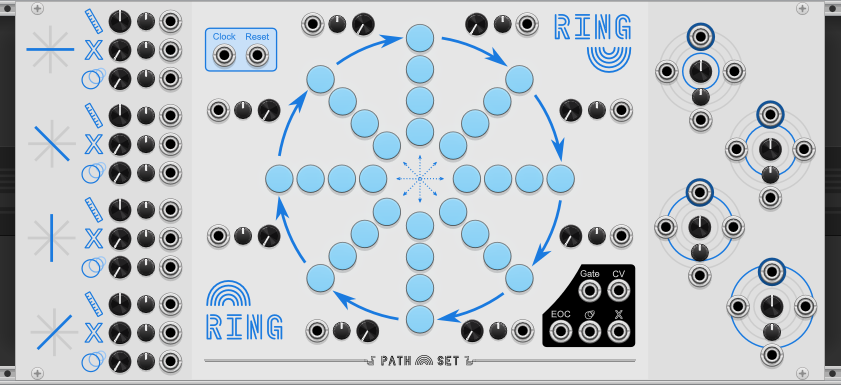
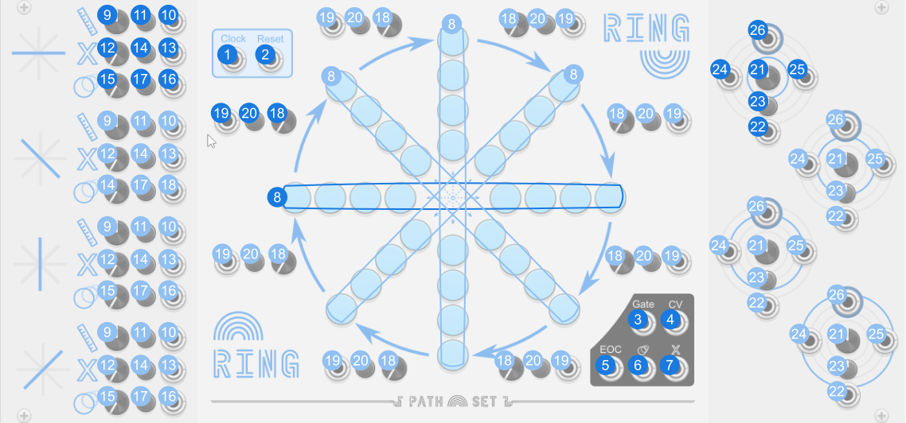

# Ring

Ring consists for four concentric rings of Notes. Play sequences across the rings. Rotate the rings to make those sequences shift over time.

Ring is best understood in three parts:

First Ring is four 8-step sequences. One of them is the horizontal row. One is the vertical row. And the other two are the two diagonal rows. The length, mutes, and ratchets for each of these these lines are independent and controlled on the left wing of the module.

Second Ring is four concentring rings. The outer most ring down to the inner most ring. These rings can be “rotated” moving the notes clock wise or counter clock wise. This effectively jumbles up the “lines”, creating more variation over time. The controls for these rotations are on the right wing of the module.

Finally the central panel has the Jump controls. These controls allow the playhead to jump between lines. The Jump Points section bellow describes this functionality in more details.

Like every sequencer in the Rainbows set, Ring is designed to sequence notes. Each step in the sequence can be set to a specific note by clicking the corresponding note. Ring can also have two different expanders. One adds more play-heads the other one adds configurable randomizing triggers.

## Video

## Panel

1. **Clock input** - Advances the sequencer to the next state depending on which ports are connected.
2. **Reset input** - Resets the sequencer to the first state and resets all nodes to their last manually selected mode.
3. **Gate output** - Gate signal to attach to a voice or envelope generator.
4. **CV output** - The CV value here matches the knob of the current state. 
5. **End of Cycle Gate output** - Gate signal that is high on the first step of the sequence after each time the cycle ends.
6. **Ratchet Gate output** - Gate signal that is high whenever the sequencer is ratcheting.
7. **Mute Gate output** - Gate signal that is high whenever the sequencer is muted.
8. **Notes** - The Notes on Ring are divided into four eight-step sequences. Right click for more options.

**Sequences**

The left wing of the panel has controls per sequence. The sequences are labeled Horizontal, Descending Diagonal, Vertical, Ascending Diagonal. Each of these sequences has the following controls:

9. **Length Knob** - Sets the length of the sequence. When above 8, the sequence will ping-pong, repeating each end node.
10. **Length CV** - Modulates Sequence Length Knob.
11. **Length Attenuverter** - Modifies the CV for the Sequence Length Knob.
12. **Mute Knob** - Makes notes silent. The higher the knob the more often this happens. When the note is silent, the normal `Gate` is low and the `CV output` holds its previous value.
13. **Mute CV** - Modulates Mute Chance Knob.
14. **Mute Attenuverter** - Modifies the CV for the Mute Chance Knob.
15. **Ratchet Knob** - Makes notes play quickly. The higher the knob the more often this happens. The number of notes played can be configured from Ratchet Speed option the contextual menu.
16. **Ratchet CV** - Modulates Ratchet Chance Knob.
17. **Ratchet Attenuverter** - Modifies the CV for the Ratchet Knob.

**Jump Points**

The central panel has eight arrows, connecting the ends of all the sequences. Each of those arrows has the following controls:

18. **Jump Knob** - Allows the the playhead to jump from one sequence to the next in a clockwise direction. The playhead can only jump when the sequence has reached its run through the sequence. The value on the knob determines how far it will jump. For example, when set to 1.3 the sequence will have a 30% chance to jump 2 steps, and 70% chance to jump 1.
19. **Jump CV** - Modulates Jump Chance Knob.
20. **Jump Attenuverter** - Modifies the CV for the Jump Knob.

An astute observer will notice there are 8 jump points but only 4 sequences. Half of the jump points connect to the back end of a sequence. When a playhead reaches the back end of a sequence, it plays that sequence in reverse. 

It's also worth noting the jump from the back end of a sequence will not trigger when the sequence is playing forward, and vise-versa. This means at any given time there is only ever one knob that can jump the playhead to a new sequence. This means if any of the jump knobs are at 0, the playhead can get stuck on that sequence.

**Rings**

The right wing of the panel has controls per ring. The rings are numbered 1 to 4. With 1 being the inner most ring.

21. **Ring # Cycle Knob** - Causes the notes in a ring to rotate periodically. At a value of 1 or -1, the ring will rotate each time the playhead completes one run through its current sequence. A positive value makes the ring rotate clockwise, and a negative value makes it rotate counterclockwise.
22. **Ring # Cycle CV** - Modulates Ring # Cycle Chance Knob.
23. **Ring # Cycle Attenuverter** - Modifies the CV for the Ring # Cycle Knob.
24. **Ring # Cycle Left Trigger** - A rising value on this input will cause the ring to rotate one step to the left, regardless of what value the Cycle Knob is set to.
25. **Ring # Cycle Right Trigger** - A rising value on this input will cause the ring to rotate one step to the right, regardless of what value the Cycle Knob is set to.
26. **Ring # Cycle Gate output** - This gate will be high whenever the ring rotates, regardless of direction or source of the rotation.

## Features

### Notes

Like every sequencer in the Rainbows set, the notes on Ring can be set clicking the light. Left clicking will cycle through the notes from the currently selected scale and range. Right clicking will allow for more options. From the right click menu you can:

- **Set Note** - Lets you set the note from the current scale and range.
- **Set Any Note** - Lets you set the note, even if its not in the current scale.
- **Randomize Notes** - Options for randomizing notes.
  - **Randomize All Notes** - Randomizes ALL notes on the module. Only selects from the current scale.
  - **+1 Octave To Some Notes** - Shifts some notes up an octave.
  - **-1 Octave To Some Notes** - Shifts some notes down an octave.
- **Set Scale** -  Change the scale and randomizes all notes on the module.
- **Root Note** -  Change the root note and shifts all entered notes up by the difference from the current root note to the new root note.

### Play Head Expander

Like every sequencer in the Rainbows set, Ring has a play head expander. You can add the expander in the contextual menu. The expander creates four independent playheads. When the expander is attached you will see the selected note ring is now broken up into four quadrants, one for each of the four playheads.

The `Clock` and `Reset` inputs on the main module drive all four playheads, but you can also use independent clock and reset inputs on the expander to drive each playhead at a different rate.

On Ring, the four playheads automatically start on the four different sequences.

### Randomizer Expander

Like every sequencer in the Rainbows set, Crossing has randomizer expander. You can add the expander in the contextual menu. The expander gives you four button & trigger pairs that can be used to randomize notes on the module.

The randomized notes can be configured. Hold down a button for one second to enter configuration mode. In configuration mode clicking a note on the panel toggles it on and off. Hold down the button on the expander again to exit configuration mode.

### Contextual Menu

- **Randomize Notes** - Options for randomizing notes.
  - **Randomize All Notes** - Randomizes ALL notes on the module. Only selects from the current scale.
  - **+1 Octave To Some Notes** - Shifts some notes up an octave.
  - **-1 Octave To Some Notes** - Shifts some notes down an octave.
- **Set Scale** -  Change the scale and randomizes all notes on the module.
- **Root Note** -  Change the root note and shifts all entered notes up by the difference from the current root note to the new root note.
- **Range** - Sets the range of the current notes. Octave range is centered around the perfect 5th note above the root note.
- **Ratchet Speed** - Controls how fast the Ratchet mode plays. When set to `Whole Notes` the Ratchet speed is equal to the clock. `Half Notes` plays twice per clock etc.
- **Active Cursor Color** - Controls what color ring is used to show which notes are active.
- **Add Expander** - Add various expanders.
  - **Play Head Expander** - Gives the module 3 more playheads.
  - **Randomizer Expander** - Gives buttons and triggers for randomizing notes on the module.

### Bypass

When Ring is bypassed the `Gate output` is connected to the `Clock input`.
