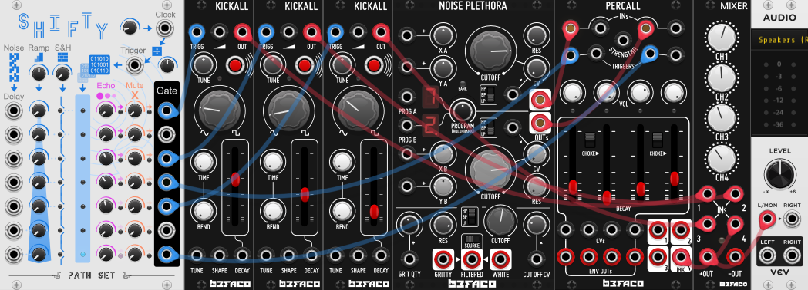
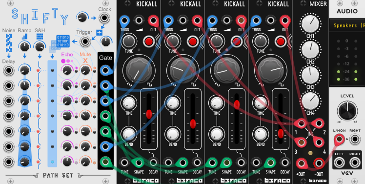

# Shifty

Shifty is a shift register for gates / triggers with controllable lookback / delay. Shifty lets you take a simple gate sequence and create seven varied gate outputs.

Shifty has a built in clock and clock divider. So unpatched you see that every second or so the the top blue light turn on and then shift down.

You can control the speed at which the lights shift with the `Clock Rate` knob or by patching in your own `Clock`. The `Clock Divider` or `Trigger` controls how often the top light turns on.

Connect to the seven `Output Gates` to tap into those delayed clock signals.

## Quick Start

[Download Quick Start](../examples/Shifty/Shifty_QuickStart.vcvs?raw=true)

This simple drum loop uses Shifty's internal clock and 5 of the 7 output gates to drive voices from [Befaco](https://library.vcvrack.com/Befaco).

Try turning the Ramp Knob up and down.

## Functionality

### Delay

By default Shifty is set up to delay each row by one beat / clock. This can be changed by adjusting the `Ramp` Knob at the top of Shifty. Turn `Ramp` all to way to the left and every row hits at once. Turn `Ramp` all the way to the right and it takes two beats for each row to hit.

Bellow the ramp knob are the `Delay CV inputs and knobs`. These add to the ramp value allowing you adjust the delay up or down for each row.  The `Delay` input is normalized to white noise allowing you to just use the knobs to add randomness. The noise ranges from 0 to 10 volts and at 10 volts the row is delayed an extra 16 beats.

Finally you can add stability to to the delays with the `Sample & Hold` knob. This knob controls how likely each row's total delay value is to be held, indicated by the red light in the row. Turning the knob all the way to the right effectively freezes the current delay pattern. Note the sample and hold chance is triggered every time the clock divider triggers, regardless of whether or not the trigger input is connected. The sample and hold values persist when the patch is saved.

### Echo and Mute

Between the shift register and the outputs are the `Echo` and `Mute` knobs. Use them to add more or less hits on each row. By default they don't do anything and you can see you can see the pink and orange lights match the blue light on the same row.

Turn the`Echo` knob up to add up to 3 extra hits to that row's gate. Each of the extra hits follow slightly different timings depending on how far the `Echo` knob is turned. This means there is a lot of variety of patterns you can get as you fine-tune the knob. The echo timing is also influenced by the incoming `Delay` value, allowing for more variety or stability depending on how the delay side is configured.

The `Mute` knob suppresses hits. If you have a frequent trigger or a lot of echos it can be helpful mute some of the hits. The mute knob pans through 693 different 24 beat patterns ranging from all beats passing to no beats passing. The mute pattern is further modified by the delay values so that you crank the clock divider all the way down to 1 you can still use the mute knob to get interesting and changing patterns.

### Expander

*Add the Expander using the contexual menu.*

The Shifty expander give you CV control over many of the paramters on the main panel. Each CV also has a dedicated Attenuverter for even more control.

The top of the Expander has CVs for the internal clock rate, the clock divider, the ramping delay, and the sample and hold chance. The bottom of the module has CVs for the Echo and Mute paramters for each of the 7 rows on the main panel.

### Bypass

When Shifty is bypassed the `Clock Input` is rounted to all the seven `Gate` outputs.

## Patch Examples

### Evolving Drums 

[Download Evolving Drums Example](../examples/Shifty/Shifty_Example_EvolvingDrums.vcvs?raw=true)

In this example the internal noise and sample and hold are used to slowly allow the drum sequenece to change over time. Several of the rows are Delay CVs are turned up, and since the delay CVs are not patched, the internal noise is used instead. The Sample & Hold chance is turned up high. This means the delay values are likely to stay the same every cycle but have a small chance to change.

This patch is also using green cables to modulate the voices. The rows with the green cables have their Echo knob nurned ups so their modulations have a higher chance of hitting when the voice is also playing.

### More Examples
* [Shifty_Example0](https://github.com/patheros/PathSetModules/blob/main/examples/Shifty_Example0.vcv) - Using Shifty as a Clock
* [Shifty_Example1](https://github.com/patheros/PathSetModules/blob/main/examples/Shifty_Example1.vcv) - Uses the first two gates of Shift to drive a drum beat out of two [Palettes](https://library.vcvrack.com/Atelier/AtelierPalette) and the remaining gates are used as CVs on the VCOs and effects.
* [Shifty_Example2](https://github.com/patheros/PathSetModules/blob/main/examples/Shifty_Example2.vcv) - 5 Shiftys working to drive 3 different voices. Each voice showing off different ways to use Shifty.
* [Shifty_Example3](https://github.com/patheros/PathSetModules/blob/main/examples/Shifty_Example3.vcv) - Shifty outputs are merged to create a polyphonic gate. Along with a polyphonic VCO this creates melodic variety with a high degree of configurability.
* [Shifty_Example4](https://github.com/patheros/PathSetModules/blob/main/examples/Shifty_Example4.vcv) - More examples of melodic patterns created by Shifty and chaining shifty together.
* [Shifty_Example5](https://github.com/patheros/PathSetModules/blob/main/examples/Shifty_Example5.vcv) - Using LFOs to mores slowly change Shifty's pattern over time. 

