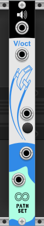

# Shuttle

Shuttle is a additive sine-wave oscillator with an infinite permutation of harmonics. Randomize the harmonics or control them on a single polyphonic cable.

## Panel

1. **1V/octave input** - Controls the frequency of the output audio.
2. **Audio output** - Audio output of module.
3. **Travel button** - Generates a new set of harmonics.
4. **Travel input** - Generates a new set of harmonics.
5. **Location output** - 16 channel polyphonic output with CV values corresponding to amplitudes of the fundamental sine-wave and its 15 harmonics.
6. **Location input** - Input to override the amplitudes of the fundamental sine-wave and its 15 harmonics.

## Features

### Location

The "Location" of the shuttle is 16 CV voltages that correspond to the amplitudes of the fundamental sine-wave and its 15 harmonics. A new location can be generated using the Travel button or trigger. The current location is provided on the Location output jack as a 16 channel polyphonic output. The location can be overridden by patching the Location input. When the Location input is patched the Location output is unaffected and Travel button and trigger only change the Location output.

### Bypass

When Shuttle is bypassed all outputs stay at 0V.
