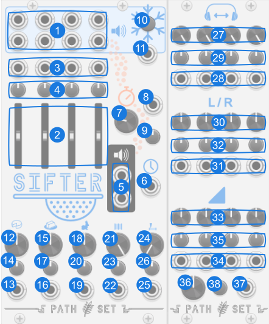

# Sifter

Sifter is a granular "mixer". Feed in up to four different audio sources and create an output that pulls grains from all four samples.

## Panel

1. **L/R Audio Inputs** - Four different audio inputs. Input D is normalized to the internal delay loop of the `mix output`.
2. **Intensity Fader** - Controls how often each input is sampled for the output. The sum of all intensities also controls the overall amplitude of the `mix output`.
3. **Intensity CV** - Modulates Intensity Fader.
4. **Intensity Attenuverter** - Modifies CV for Intensity Fader.
5. **L/R Mix Output** - Outputs audio after the granulated mixing.
6. **Clock Input** - Optional input that resets the playback positions each time it goes high. Particularly useful if the input signals are `frozen`.
7. **Feedback Delay Knob** - Controls the internal feedback delay time that is fed into input D if cable is not patched.
8. **Feedback Delay CV** - Modulates Feedback Delay Knob.
9. **Feedback Delay Attenuverter** - Modifies CV for Feedback Delay Knob.
10. **Freeze Inputs** - Toggles if the input audio samples are being recorded. When frozen they are not. Note that freezing happens on the input so even when frozen the intensity faders will still affect how often each of the frozen samples are used to create grains.
11. **Freeze Inputs Trigger** - Toggles the frozen state when this goes high.
12. **Grain Length Knob** - Controls how long each grain is.
13. **Grain Length CV** - Modulates Grain Length Knob.
14. **Grain Length Attenuverter** - Modifies CV for Grain Length Knob.
15. **Grain Overlap Knob** - Controls how many grains are playing at once.
16. **Grain Overlap CV** - Modulates Grain Overlap Knob.
17. **Grain Overlap Attenuverter** - Modifies CV for Grain Overlap Knob.
18. **Playback Speed Knob** - Controls how fast the grain playback head moves through the samples. This does not affect the pitch. When below 1, this can create delay effects as the playback head can fall behind the record head.
19. **Playback Speed CV** - Modulates Playback Speed Knob.
20. **Playback Speed Attenuverter** - Modifies CV for Playback Speed Knob.
21. **Buffer Length Knob** - Controls how much of the sample buffers are used when playing grains. Turn this down when frozen to create very short snippets.
22. **Buffer Length CV** - Modulates Buffer Length Knob.
23. **Buffer Length Attenuverter** - Modifies CV for Buffer Length Knob.
24. **Buffer Start Knob** - Controls where in the sample buffers the grains the playback window comes from. This is particularly useful when frozen and the buffer length is short.
25. **Buffer Start CV** - Modulates Buffer Start Knob.
26. **Buffer Start Attenuverter** - Modifies CV for Buffer Start Knob.

**Expander**

*Added through contextual menu*

27. **Stereo Width Knob** Controls how Stereo vs Mono a particular input channel is in the resulting mix.
28. **Stereo Width CV** Modulates Stereo Width Knob.
29. **Stereo Width Attenuverter** Modifies CV for Stereo Width Knob.
30. **Pan Knob** Controls how much a specific input channel is exclusive routed to the left output or the right output.
31. **Pan CV** Modulates SPan Knob.
32. **Pan Attenuverter** Modifies CV for Pan Knob.
33. **Volume Knob** Controls the volume for a particular input channel.
34. **Volume CV** Modulates Volume Knob.
35. **Volume Attenuverter** Modifies CV for Volume Knob.
36. **Master Volume Knob** Controls overal volume of the output.
37. **Master Volume CV** Modulates Stereo Width Knob.
38. **Master Volume Attenuverter** Modifies CV for Stereo Width Knob.

## Bypass
When Sifter is bypassed all outputs stay at 0V.
