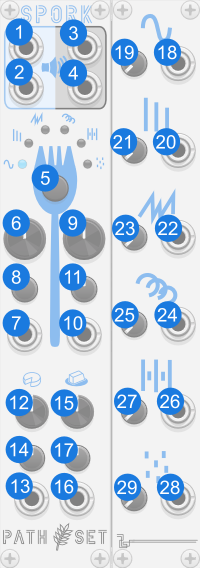

# Spork

Spork is compact granular effects module. It has six togglable modes, each with two mysterious parameters. As well as a grain size and overlap paramters. Each of the four parameters has a dedicated CV and attenuverter.

## Panel

1. **Audio Input** - Audio input for effect.
2. **Audio Output** - Audio output for effect.
3. **Mode Select** - Select which effect is in use. Current effect indicated by lights.
4. **Mod A Knob** - Parmater A for the selected effect. See mode descriptions for more details.
5. **Mod A CV** - Modulates Mod A knob.
6. **Mod A Attenuverter** - Modifies CV for Mod A knob.
7. **Mod B Knob** - Parmater B for the selected effect. See mode descriptions for more details.
8. **Mod B CV** - Modulates Mod B knob.
9. **Mod B Attenuverter** - Modifies CV for Mod B knob.
10. **Grain Size Knob** - Controls size of each grain being playd in the effect.
11. **Grain Size CV** - Modulates Grain Size knob.
12. **Grain Size Attenuverter** - Modifies CV for Grain Size knob.
13. **Grain Overlap Knob** - Controls how many grains are being played at once.
14. **Grain Overlap CV** - Modulates Grain Overlap knob.
15. **Grain Overlap Attenuverter** - Modifies CV for Grain Size knob.

## Effects

### Tines

Modulates the grain start time with a sign wave.
- **Mod A** - Rate of sign wave.
- **Mod B** - Amplitude of the wave.

### Stutter

Modulates the grain start time with a fast triangle wave.
- **Mod A** - Rate of triangle wave.
- **Mod B** - Amplitude of the wave.

### Buzz

Modulates the grain start time with stair-step wave.
- **Mod A** - Distance between each step.
- **Mod B** - Amplitude of the wave.

### Repeat

Modulates the grain start time with a slow triangle wave.
- **Mod A** - Rate of triangle wave.
- **Mod B** - Amplitude of the wave.

### Skip

Randomly delays some grain start times by a fixed amount.
- **Mod A** - Chance of grain being delayed.
- **Mod B** - Amount grain is delayed by.

### Scatter

Randomly delays some grain start times by a variable amount.
- **Mod A** - Stability of delay. At 0 the delay is nearly random each time. At 1 the delay drifts slowly. 
- **Mod B** - Amplitude of delay.

### Bypass

When Spork is bypassed the `Audio Input` is routed to the `Audio Output`.

