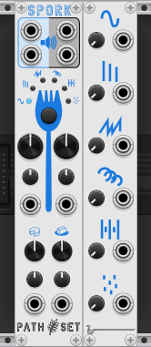

# Spork

Spork is compact granular effects module. It has six togglable modes, each with two mysterious parameters, as well as a grain size and overlap parameters. Each of the four parameters has a dedicated CV and attenuverter.

## Panel

1. **Left Audio Input** - Left Audio input for effect.
2. **Right Audio Input** - Right Audio input for effect.
3. **Left Audio Output** - Left Audio output for effect.
4. **Right Audio Output** - Right Audio output for effect.
5. **Mode Select** - Select which effect is in use. Current effect indicated by lights.
6. **Mod A Knob** - Paramater A for the selected effect. See mode descriptions for more details.
7. **Mod A CV** - Modulates Mod A knob.
8. **Mod A Attenuverter** - Modifies CV for Mod A knob.
9. **Mod B Knob** - Paramater B for the selected effect. See mode descriptions for more details.
10. **Mod B CV** - Modulates Mod B knob.
11. **Mod B Attenuverter** - Modifies CV for Mod B knob.
12. **Grain Size Knob** - Controls size of each grain being played in the effect.
13. **Grain Size CV** - Modulates Grain Size knob.
14. **Grain Size Attenuverter** - Modifies CV for Grain Size knob.
15. **Grain Overlap Knob** - Controls how many grains are being played at once.
16. **Grain Overlap CV** - Modulates Grain Overlap knob.
17. **Grain Overlap Attenuverter** - Modifies CV for Grain Size knob.

**Expander**

*Added through contextual menu*

18. **Tines CV Input** - Controls how strong the Tines effect is applied. Normalized to 5Vs.
19. **Tines Knob** - Controls how much the Tines effect is applied. Works like an Attenuator when the CV is connected.
20. **Stutter CV Input** - Controls how strong the Stutter effect is applied. Normalized to 5Vs.
21. **Stutter Knob** - Controls how much the Stutter effect is applied. Works like an Attenuator when the CV is connected.
22. **Buzz CV Input** - Controls how strong the Buzz effect is applied. Normalized to 5Vs.
23. **Buzz Knob** - Controls how much the Buzz effect is applied. Works like an Attenuator when the CV is connected.
24. **Repeat CV Input** - Controls how strong the Repeat effect is applied. Normalized to 5Vs.
25. **Repeat Knob** - Controls how much the Repeat effect is applied. Works like an Attenuator when the CV is connected.
26. **Skip CV Input** - Controls how strong the Skip effect is applied. Normalized to 5Vs.
27. **Skip Knob** - Controls how much the Skip effect is applied. Works like an Attenuator when the CV is connected.
28. **Scatter CV Input** - Controls how strong the Scatter effect is applied. Normalized to 5Vs.
29. **Scatter Knob** - Controls how much the Scatter effect is applied. Works like an Attenuator when the CV is connected.

## Effects

### Tines

Modulates the grain start time with a sine wave.
- **Mod A** - Rate of sine wave.
- **Mod B** - Amplitude of the wave.

### Stutter

Modulates the grain start time with a fast triangle wave.
- **Mod A** - Rate of triangle wave.
- **Mod B** - Amplitude of the wave.

### Buzz

Modulates the grain start time with stair-step wave.
- **Mod A** - Distance between each step.
- **Mod B** - Amplitude of the wave.

### Repeat

Modulates the grain start time with a slow triangle wave.
- **Mod A** - Rate of triangle wave.
- **Mod B** - Amplitude of the wave.

### Skip

Randomly delays some grain start times by a fixed amount.
- **Mod A** - Chance of grain being delayed.
- **Mod B** - Amount grain is delayed by.

### Scatter

Randomly delays some grain start times by a variable amount.
- **Mod A** - Stability of delay. At 0 the delay is nearly random each time. At 1 the delay drifts slowly. 
- **Mod B** - Amplitude of delay.

### Exapnder

When the expander is attached, Spork no longer applies a single mode. Snstead all six modes can be applied at varying strengths. Use the knobs and CVs on the expander to control how strong each mode is. The expander is added through the contextual menu.

## Bypass

When Spork is bypassed the `Audio Input` is routed to the `Audio Output`.

## Patch Examples

### Feedback

[Download Example 1](../examples/Spork/Spork_Example1.vcvs?raw=true)

In this example, an [8Seq](https://library.vcvrack.com/JW-Modules/8Seq) is playing [Palette](https://library.vcvrack.com/Atelier/AtelierPalette) with the model of Palette being changed randomly. The sound for Palette along with a feedback loop from Spork is fed into Spork. Play around with the mode and parameters of Spork to find interesting sounds. You can bypass Spork to hear the raw sound from Palette. You can bypass the Random module to prevent the raw sound from changing.
