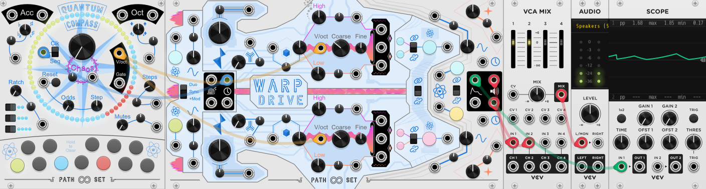
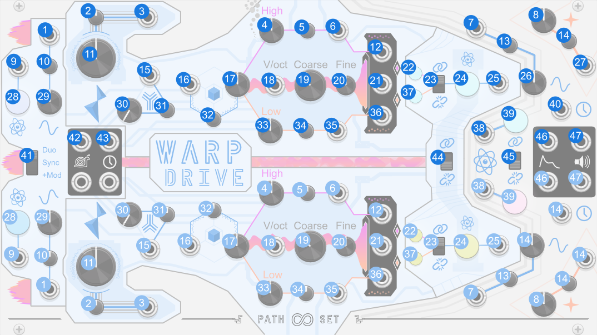
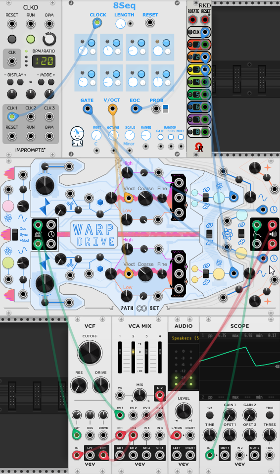

# Warp Drive

Warp Drive is a massive two-engine starship. Each engine is a voice with its own LFO and envelope. Each engine's voice consists of three oscillators, called coils. The main coil is the carrier wave and the other two provide the modulation.

## Quick Start

1. Connect the `Clock Left output` on WarpDrive to the `Clock` on a sequencer.
2. Connect the quantized output of the sequencer to both `1V/octave` inputs on WarpDrive.
3. Connect the `Audio Left output` and `Audio Right output` to your mixer.
4. Connect the `Envelope Left output` to a scope.

[Download Quick Start](../examples/WarpDrive/WarpDrive_QuickStart.vcvs)

## Panel

1. **LFO/Clock Rate CV** - Modulates LFO/Clock Rate knob.
2. **Alignment Attenuverter** - Modifies CV for Alignment knob.
3. **Alignment CV** - Modulates Alignment knob.
4. **High Coil Power knob** - Adjusts intensity of high coil which frequency modulates the main coil.
5. **High Coil Power Attenuverter** - Modifies CV for High Coil Power knob.
6. **High Coil Power CV** - Modulates High Coil Power knob
7. **Envelope Rate CV** - Modulates Envelope Rate knob
8. **Gravitation knob** - Adjust the shape of every wave on that side of the ship.
9. **New LFO/Clock Signature Trigger** - Creates a new pattern for the LFO/Clock.
10. **LFO/Clock Rate Attenuverter** - Modifies CV for LFO/Clock Rate knob.
11. **Alignment knob** - Controls internal modulation of the high and low coil power knobs.
12. **High Coil output** - Audio output from the high coil.
13. **Envelope Rate Attenuverter** - Modifies CV for Envelope Rate knob.
14. **Gravitation Attenuverter** - Modifies CV for Gravitation knob.
15. **Mixture CV** - Modulates Mixture knob.
16. **Coil Attachment CV** - Modulates Coil Attachment knob.
17. **Coil Attachment knob** - Controls how the high and low coil signals are combined before frequency modulating the main coil.
18. **1V/octave input** - Controls the frequency of all the coils.
19. **Coarse Frequency** - Controls the coarse frequency of all the coils.
20. **Fine Tune** - Fine tunes the frequency of all the coils.
21. **Main Coil output** - Audio output from the main coil.
22. **High Coil Signature button** - Creates a wave shape for the high coil.
23. **Coil Coupling switch** - When on, all three coils share the same wave shape.
24. **Main Coil Signature button** - Creates a wave shape for the main coil.
25. **New Main Coil Signature Trigger** - Creates a wave shape for the high coil.
26. **Envelope rate knob** - Controls the speed at which the envelope plays.
27. **Gravitation CV** - Modulates Gravitation knob.
28. **LFO/Clock Signature button** - Creates a new pattern for the LFO/Clock.
29. **LFO/Clock Rate knob** - Controls the speed of the LFO/Clock.
30. **Mixture knob** - Controls where the Alignment knob's internal modulation comes from.
31. **Mixture Attenuverter** - Modifies CV for Mixture knob.
32. **Coil Attachment Attenuverter** - Modifies CV for Coil Attachment knob.
33. **Low Coil Power knob** - Adjusts intensity of low coil which frequency modulates the main coil.
34. **Low Coil Power Attenuverter** - Modifies CV for Low Coil Power knob.
35. **Low Coil Power CV** - Modulates Low Coil Power knob.
36. **Low Coil output** - Audio output from the low coil.
37. **Low Coil Signature button** - Creates a wave shape for the low coil.
38. **New Envelope Signature Trigger** - Creates a new envelope shape.
39. **Envelope Signature Button** - Creates a new envelope shape.
40. **Clock Input** - Triggers the envelope to play. Normalized to the Clock output.
41. **LFO/Clock Coupling** - Controls if the LFO/Clock pattern are the same or different.
42. **LFO output** - Raw LFO output.
44. **Clock output** - Clock signal generated from LFO output. 
44. **Engine Coupling** - When on, the coils on the left and right engine use the same wave shape.
45. **Enveloper Coupling** - When on, the envelopes on the left and right engine use the same shape.

## Features

### LFO & Clock

The left of the panel has the LFO section. The LFO has an internal `signature` that can be randomized through a button or a trigger. The LFO also has a `rate` that controls the overall rate at which the LFO plays.

The LFO signal is also used to generate a chaotic clock signal. Both the LFO and clock signals are available as outputs on the left of the module.

The `LFO/Clock Coupling` switch controls which engine's clock signals are routed up to envelope generators. The switch has three modes:
* **Duo** - Each engine's envelope is clocked independently by each engine's clock. 
* **Sync** - Only the left clock is used and is sent to both envelopes.
* **+Mod** - The left clock is used by both envelopes but the right LFO modulates the left LFO's rate.  

### Envelope

The right of the panel has the Envelope section connected with blue lines. The Envelope has an internal `signature` that can be randomized through a button or a trigger. The envelope also has a `rate` that controls how fast the envelope develops. 

Each envelope is triggered by an independent `clock input` that normalized to the clocks from the engine section of the Warp Drive.

The `envelope coupling` switch links the right envelope's signature to the left envelope. When the envelopes are linked they share the same wave form, but can have independent rates and triggers.

### Gravitation

The right of the panel has the `gravitation` section in orange. Gravitation affects the shape of the of all wave forms on that side of the ship. This includes the three audio coils, the LFO and the envelope. 

### Coils

The heart of the sound of Warp Drive comes from `Main Coil` of each engine. Each main coil which is controlled by a `V/oct` input as well as`Coarse` and `Fine` knobs. The main coil has a `signature` button and trigger. There is also an `engine coupling` switch which connects the left and right engine's main coil signatures.

The main coils can also be frequency modulated by the `high coil` and `low coil`. This modulation can be controlled through the `high coil power` and `low coil power` knobs in each engine. When the power knobs are at 0 (12 o'clock) they provide no modulation. Turning the knob to the left runs the high coil at 2x the speed and the low coil at 1/2 the speed. Turning the knobs to the right runs the high coil at 4x the speed and the low coil at 1/4th the speed. The further the knobs are turned way from 0 the stronger the frequency modulation is.

Note that the low and high coils have their own signatures that can be linked to the main coil or unlinked. Unlinking coils can create very crunchy sounds.

### Coil Attachment

The `Coil Attachment` knobs affect how the high and low coil signals are combined before modulating the main coil. When the attachment knob is at 0.5 (12 o'clock) the two side coils are added together, but the dial sweeps between 6 other forms of combination.

### Alignment and Mixture

The `Alignment` knob can add modulation to the high and low coil's power. By default when alignment is at 0 (12 o'clock) no modulation is added. Turning the `Alignment` knob to the right adds modulation from LFO and/or Envelope from that side of the engine. Turning the `Alignment` knob to the left adds it from the *other* engine's LFO and/or Envelope.

The `Mixture` knob controls whether the Envelope or the LFO is used for that modulation. All the way to the left only the LFO is used. All the way to the right only the envelope is used. In the middle a combination of the two are used and different combination is used for the high coil power vs the low coil power.

## Misc

### Bypass
When Wapr Drive is bypassed all outputs stay at 0V.

## Patch Examples

This example patch uses 8 modules.
Row 1: [A clock](https://library.vcvrack.com/ImpromptuModular/Clocked-Clkd), [A Sequencer](https://library.vcvrack.com/JW-Modules/8Seq), and [Clock Divider](https://library.vcvrack.com/Ohmer/RKD)
Row 2: Warp Drive
Row 3: VCF, Mixer, Audio Output.

1. The Clock drives Sequencer.
2. The Sequencer's Gate output is connected up to both `Clock inputs`  on WarpDrive.
3. The Sequencer's quantized V/Oct is connected to both `1V/octave intputs` on WarpDrive.
4. The Sequencer's End of Cycle is connected to the Clock on the clock divider.
5. The Clock Dividers 2nd output is connected to the `New Main Coil Signature Trigger L input` on WarpDrive.
6. The Clock Dividers 3rd output is connected to the `New Main Coil Signature Trigger R input` on WarpDrive.
7. WarpDrive's `LFO L output` is connected to the volume CV on the first channel of the mixer.
8. WarpDrive's `LFO R output` is connected to the cutoff CV on the VCF.
9. WarpDrive's `Audio L output` is connected to the input on the VCF.
10. WarpDrive's `Audio R output` is connected to the first channel on the mixer.
11. The VCF's output is connected to the second channel on the mixer.

[Download Example 1](../examples/WarpDrive/WarpDrive_Example1.vcvs)